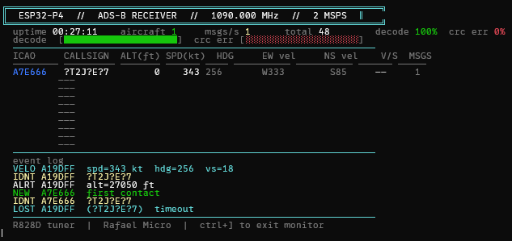

# esp32p4-rtl-sdr-v4

An ESP32-P4 port of [kvhnuke/esp32-rtl-sdr](https://github.com/kvhnuke/esp32-rtl-sdr) with full ADS-B decoding and a live terminal UI. Receives 1090 MHz Mode-S/ADS-B transmissions from aircraft using an RTL-SDR dongle (tested with RTL-SDR V4 / R828D tuner) connected via USB to an Waveshare ESP32-P4 Nano.



---

## What's new in this fork

The original esp32p4 branch had the RTL-SDR driver and tuner support in place but I could not sustain USB streaming. This fork resolves some bugs and adds a live ADS-B decoder with terminal UI.

### Fixes

**USB transfer deadlock** - `rtlsdr_open()` was being called from inside a USB host event callback. Control transfers issued during device init required the USB host event loop to process their completions, but the event loop was blocked waiting for the callback to return. Fixed by moving all device initialisation into a dedicated `rtlsdr_setup_task` that runs outside the callback, allowing `class_driver_task` to keep pumping USB events.

**Task watchdog / cross-core scheduler deadlock** - The bulk transfer wait loop used `vTaskDelay(1)` to spin while waiting for transfer completion. At 2 MSPS this generated ~122 transfers/second, each triggering a cross-core yield interrupt from CPU1 to CPU0. The FreeRTOS scheduler locked up under this load, starving the IDLE task and triggering the watchdog. Fixed by replacing the spin-wait with a `SemaphoreHandle_t` - the waiting task blocks properly and is woken cleanly by the transfer callback.

**CPU affinity** - `adsb_rx_task` is pinned to CPU1. The USB host stack, `class_driver_task`, and `rtlsdr_setup_task` all run on CPU0. This keeps USB event processing and bulk transfer callbacks on the same core, eliminating cross-core contention during the read loop.

### Tweak

**USB transfer size** - The original used `MAX_PACKET_SIZE 128000` which caused
issues with my ESP32-P4 USB host controller with tons of transfer
failures. Reduced to 16384 bytes per transfer, with two transfers assembled into
a 32KB demodulation buffer.

### Added
*TUI is a rough Draft and will be expanded
- **ADS-B decoder** using the mode-s library, decoding DF17 extended squitter messages
- **Live TUI** rendered via ANSI escape codes directly in the ESP-IDF serial monitor — no host software required
- **Aircraft tracking table** showing ICAO address, callsign, altitude, ground speed, heading, EW/NS velocity components, vertical rate, and message count
- **Event log** showing new contacts, lost contacts, identification, altitude, and velocity events
- **Decode quality bars** showing decode rate and CRC error rate in real time
- **60-second contact timeout** — aircraft are removed from the table if no messages are received for 60 seconds

---

## Building

Requires ESP-IDF v5.4 or later. I used 5.4.3. 

```bash
git clone --branch esp32p4 https://github.com/SAMSON1TE/esp32p4-rtl-sdr-v4
cd esp32p4-rtl-sdr-v4
idf.py set-target esp32p4
idf.py build flash monitor
```

The serial monitor will show the TUI once the dongle enumerates and the tuner locks. Press `ctrl+]` to exit the monitor.

---


## Known limitations

- Position (lat/lon) is not decoded as I struggled finding how to get this to work from the source.
- Only one dongle is supported at a time.
- Tested only with RTL-SDR V4. Other dongles with supported tuners (E4000, FC0012, FC0013, FC2580, R820T) should work but are untested on P4.

---

## Credits

- Original ESP32 RTL-SDR port: [kvhnuke/esp32-rtl-sdr](https://github.com/kvhnuke/esp32-rtl-sdr)
- RTL-SDR library: [osmocom/rtl-sdr](https://github.com/osmocom/rtl-sdr)
- Mode-S decoder: based on [antirez/dump1090](https://github.com/antirez/dump1090)
- ESP32-P4 concurrency fixes, USB semaphore rework, and ADS-B TUI: SAMSON1TE
